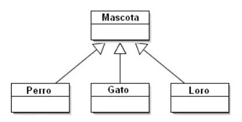
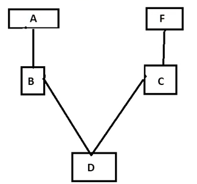
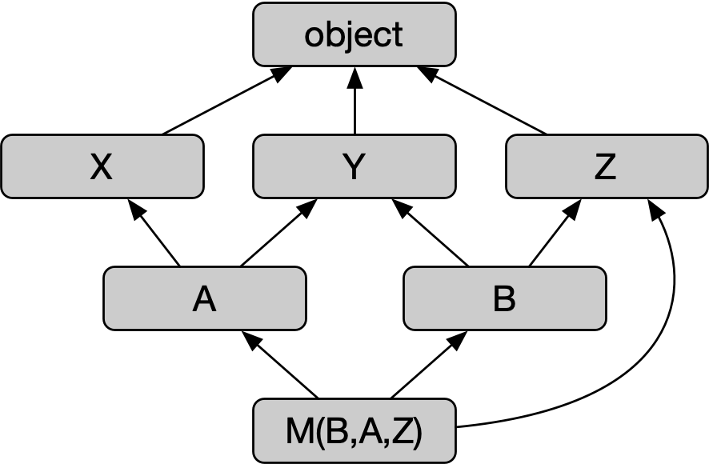

# Programación orientada a objetos

## 1. Atributos y métodos
- Los nombres de las clases siempre empiezan en mayúsculas
- Instanciar una clase = crear un objeto
- El primer método de una clase es el **método constructor**, el cual define los atributos de la misma (p, ej en la clase movil, tenemos marca, modelo, camara, ...). Define las propiedas iniciales que va a tener nuestro objeto. El método constructor se define con `def __init__(self, *atributos)`
- Un **método** es una función. Los métodos definen funciones que puede realizar el objeto (clase) creado. Recordar, siempre debemos pasar el parámetro self a estos métodos, para hacer referencia a la clase/objeto al que pertenece (de esta forma un objeto puede autoreferenciarse)

## 2. Herencia
- Cuando dentro de una clase cramos otras subclases. Por ejemplo, dentro de de la clase profesión, podemos tener ingeniero, abogado, agricultor, etc
- Permite a las clases hijas heredar a todos los métodos y a todos los atributos generados por la clase padre. Además de heredar, se pueden incluir métodos o atributos específicos dentro de dicha subclase
- Para heredar los atributos de la clase padre, usaremos de nuevo un constructor, pero en este caso será diferente, ya que el nuevo contructor tendrá el prefijo super. Es decir, tendremos `def __init__(todos_atributos): /n super().__init__(atributos_a_heredar)`
- No solo heredas atributos, también estas heredando métodos, es decir, **todas las funciones que pueda realizar las clase padre también podrán ser utilizados por la clase hija**. Si creamos un método para una subclase que coincide con un método en la clase padre, este se sobreescribirá, es decir, cuando llamamemos al método de la subclase primará su propio método y no el de la clase padre, ya que este último es más específico (esto forma parte del concepto de **polimorfismo**).
- **Herencia simple**: una clase que hereda de otra clase (solo existe una relación)
- **Herenia jerárquica**: una clase superior que cuenta con varias subclases que herdan sus métodos y atributos

### 2.1 Herencia múltiple
- Se da cuando heredamos atributos y métodos no solo de la clase padre, si no también de una de las subclases
- En este caso, para decidir de que superclase heredamos, ya no utilizamos `super().__init__`, sino que usaremos `NombreSuperClase.__init__()`
- En algunos casos, sí que podremos utilizar el método `super()`, en concreto, cuando queremos que herede un método de una clase superior
- Para comprobar si una clase es una sub clase utilziaremos `issubclass(nombre_subclase, nombre_superclase)`
- Para comprobar si un objeto que hemos creado pertenece a una clase utilizaremos el comdando `isinstance(nombre_objeto, nombre_clase)`
  
  

### 2.2 Método de resolución de orden (MRO)
- En caso de que una subclase tenga un metodo que coincide con el de la superclase, el MRO define a qué metodo le dará prioridad
- Define el orden el que Python busca métodos y atributos en las clases. Muy útil cuando hay una cadena larga de herencia en nuestro código
- En este caso es muy  útil `super()`, ya que en este caso, python consultrá el MRO para saber la próxima clase que tiene prioridad
- Recordar, heredemos desde donde heredemos, si la clase tiene un método propio que coincide con el de la superclase, siempre utilizará el de la subclase, ya que por así decirlo este último siempre es más específico (**POLIMORFISMO**)
- El orden de resolución se define por el orden en el que se incluyen las clases de herencia. Por ejemplo class D(B, C) primero hereda de B y luego de C. En el ejemplo siguiente lo  que hacemos es: primero buscamos en D, si no tiene el método al que queremos llamar, vamos a B, si este tampoco lo tiene, buscamos primero en A, ya que estamos en su "rama", si en A tampoco esta, pasamos a la otra rama y primero buscamos en C para, por último, buscar en F.
- Con el siguiente método podemos observar cual es la secuencia que una clase realiza para la búsqueda en las super clases `print(NombreClase.mro())`

## 3. Polimorfismo
El polimorfismo es una característica fundamental de la POO que permite que objetos de diferentes tipos sean tratados de manera uniforme. Esto significa que diferentes clases pueden implementar métodos o atributos con el mismo nombre, pero con comportamientos específicos para cada clase. Las principales características del polimorfismo son:
- El polimorfismo Se puede lograr mediante herencia, donde una clase derivada redefine (o sobreescribe) métodos de la clase base.
- Duck Typing : Python utiliza el concepto de "duck typing", lo que significa que no importa el tipo exacto del objeto, siempre que tenga el método requerido.
- La sobrecarga de operadores también se relaciona con el polimorfismo, ya que permite cambiar el comportamiento de operadores como +, -, etc., para diferentes tipos de objetos.

El polimorfismo permite que diferentes tipos de objetos sean tratados de manera uniforme mediante una interfaz común. Esto facilita la **creación de código más flexible, reutilizable y fácil de mantener**. Gracias a esta características, se puede simplificar el diseño del programa al permitir que diferentes clases compartan un comportamiento común, pero lo implementen de manera específica. En general, el poñlimorfismo implementa las siguientes ventajas:
- Facilita la extensibilidad ya que puedes agregar nuevas clases sin modificar el código existente.
- Mejora la legibilidad ya que el código se centra en las acciones generales y no en los detalles específicos de cada clase.

## 4. Encapsulación
La encapsulación es el proceso de ocultar los detalles internos de un objeto y exponer solo las interfaces necesarias para interactuar con él. En Python, esto se logra mediante el uso de modificadores de acceso, aunque no son estrictos como en otros lenguajes.Los principales modificadores de acceso en python son:
- Público: Los atributos y métodos son accesibles desde cualquier lugar. Por ejemplo: `self.nombre`.
- Protegido: Los atributos y métodos indicados con un guion bajo `(_)` son considerados protegidos y deben ser accedidos solo dentro de la misma clase o subclases. Por ejemplo: `self._edad`.
- Privado: Los atributos y métodos indicados con dos guiones bajos `(__)` son considerados privados y no deberían ser accedidos directamente desde fuera de la clase. Por ejemplo: `self.__saldo`.
- Hay que tener en cuenta que en Python, el encapsulamiento no es estricto. Incluso los atributos "privados" pueden ser accedidos usando `_NombreDeClase__nombre_del_atributo`.
- Es una práctica recomendada **usar métodos getter y setter para acceder/modificar atributos privados**. Es decir, nosotros creamos atributos privados y accedemos a ellos utilzando un método (función dentro de la clase) que permite acceder a dicho atributo desde fuera de la clase en caso de que esto sea necesario.

La encapsulación permite **proteger la integridad de los datos** y proporcionar un mecanismo seguro para acceder/modificar atributos, evitando que los usuarios de una clase modifiquen accidentalmente atributos internos.

## 5. Abstracción
La abstracción es el proceso de ocultar la complejidad mostrando solo los detalles esenciales al usuario. En Python, se logra mediante la creación de clases abstractas y métodos abstractos. Para crear una clase abstracta en Python, se utiliza el módulo abc (Abstract Base Classes). Las principales características de la abstracción son:
- Las clases abstractas no pueden ser instanciadas directamente.
- Fuerzan a las subclases a implementar ciertos métodos mediante el decorador `@abstractmethod`.
- Ayudan a definir una interfaz común para diferentes tipos de objetos.

La abstracción **reducir la complejidad y enfocarse en las características más importantes** de un objeto o sistema. Define una estructura base que todas las subclases deben seguir facilitando de esta forma la **creación de sistemas escalables y modularizados**. La abstracción es usada cuando se necesita definir una interfaz común para múltiples clases relacionadas pero no es necesario implementarla cuando se trabaja con clases independientes que no requieren una estructura base o comportamientos compartidos. Se basa en ocultar la clase principal, la cual puede que no se use ya que solo se utilizan las clases secundarias que heredan las características de la clase principal.

## 6. Métodos Mágicos (Magic Methods)
Los métodos mágicos, también conocidos como métodos especiales, son funciones predefinidas en Python que comienzan y terminan con doble guion bajo (__). Estos métodos permiten personalizar el comportamiento de las clases y objetos. Las principales métodos mágicos son: \
  1) **Inicialización de objetos**: `__init__(self, ...)` es el método llamado cuando se crea un objeto.
  2) **Representación de objetos**: `__str__(self)` devuelve una representación legible del objeto mientras que `__repr__(self)` devuelve una representación oficial del objeto.
  3) **Operadores aritmétcios**: `__add__(self, other)` define el comportamiento del operador `+` mientras que `__sub__(self, other)` define el comportamiento del operador `-`.
  4) **Comparaciones**
  5) **Contenedores**

## 7. Decoradores
- El decorador `@classmethod` y el parámetro `cls` en Python se utilizan para definir métodos que están asociados a la clase en lugar de a una instancia específica de la clase. Un método de clase es un método que recibe la clase como primer argumento implícito, en lugar de recibir una instancia (como lo haría un método de instancia con `self`). Esto significa que puedes llamar al método directamente desde la clase sin necesidad de crear una instancia. Los **métodos de clase** recibe `cls` como primer argumento, lo que permite acceder a los atributos y métodos de la clase en sí misma.
- El decorador `@staticmethod` en Python se utiliza para definir un **método estático** , es decir, un método que pertenece a la clase pero no tiene acceso ni a la instancia (*self*) ni a la clase (*cls*). **Es como una función regular, pero organizada dentro de una clase por razones de cohesión o diseño.** Al final, un método estático es un función que pertenece a la clase, no a una instancia y por tanto, no es necesario instanciar la clase para llamar a dicha función.
- El decorador` @property` en Python **permite convertir un método de una clase en un atributo de solo lectura**. Es decir, puedes acceder al método como si fuera un atributo sin necesidad de usar paréntesis para invocarlo