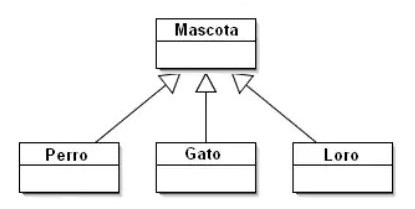
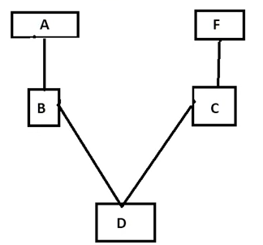

# Programación orientada a objetos

## Atributos y métodos
- Los nombres de las clases siempre empiezan en mayúsculas
- Instanciar una clase = crear un objeto
- El primer método de una clase es el **método constructor**, el cual define los atributos de la misma (p, ej en la clase movil, tenemos marca, modelo, camara, ...). Define las propiedas iniciales que va a tener nuestro objeto.
- Un **método** es una función. Los métodos definen funciones que puede realizar el objeto (clase) creado. Recordar, siempre debemos pasar el parámetro self a estos métodos, para hacer referencia a la clase/objeto al que pertenece (de esta forma un objeto puede autoreferenciarse)

## Herencia
- Cuando dentro de una clase cramos otras subclases. Por ejemplo, dentro de de la clase profesión, podemos tener ingeniero, abogado, agricultor, etc
- Permite a las clases hijas heredar a todos los métodos y a todos los atributos generados por la clase padre. Además de heredar, se pueden incluir métodos o atributos específicos dentro de dicha subclase
- Para heredar los atributos de la clase padre, usaremos de nuevo un constructor, pero en este caso será diferente, ya que el nuevo contructor tendrá el prefijo super. Es decir, tendremos `def __init__(todos_atributos): /n super().__init__(atributos_a_heredar)`
- No solo heredas atributos, también estas heredando métodos, es decir, **todas las funciones que pueda realizar las clase padre también podrán ser utilizados por la clase hija**. Si creamos un método para una subclase que coincide con un método en la clase padre, este se sobreescribirá, es decir, cuando llamamemos al método de la subclase primará su propio método y no el de la clase padre, ya que este último es más específico
- **Herencia simple**: una clase que hereda de otra clase (solo existe una relación)
- **Herenia jerárquica**: una clase superior que cuenta con varias subclases que herdan sus mmétodos y Atributos

### Herencia múltiple
- Se da cuando heredamos a tributos y métodos no solo de la clase padre, si no también de una de las subclases
- En este caso, para decidir de que superclase heredamos, ya no utilizamos `super().__init__`, sino que usaremos `NombreSuperClase.__init__()`
- En algunos casos, sí que podremos utilizar el método `super()`, en concreto, cuando queremos que herede un método de una clase superior
- Para comprobar si una clase es una sub clase utilziaremos `issubclass(nombre_subclase, nombre_superclase)`
- Para comprobar si un objeto que hemos creado pertenece a una clase utilizaremos el comdando `isinstance(nombre_objeto, nombre_clase)`
  
  

### Método de resolución de orden (MRO)
- En caso de que una subclase tenga un metodo que coincide con el de la superclase, el MRO define a qué metodo le dará prioridad
- Define el orden el que Python busca métodos y atributos en las clases. Muy útil cuando hay una cadena larga de herencia en nuestro código
- En este caso es muy  útil `super()`, ya que en este caso, python consultrá el MRO para saber la próxima clase que tiene prioridad
- Recordar, heredemos desde donde heredemos, si la clase tiene un método propio qu coincide con el de la superclase, siempre utilizará el de la subclase, ya que por así decirlo este último siempre es más específico
- El orden de resolución se define por el orden en el que se incluyen las clases de herencia. POr ejemplo class D(B, C) primero hereda de B y luego de C. En el ejemplo siguiente lo  que hacemos es: primero buscamos en D, si no tiene el método al que queremos llamar, vamos a B, si este tampoco lo tiene, buscamos primero en A, ya que estamos en su "rama"m, si en A tampoco esta, pasamos a la otra rama y primero buscamos en C para, por último, buscar en F.
- Con el siguiente método podemos observar cual es la secuencia que una clase realiza para la búsqueda en las super clases `print(NombreClase.mro())`

